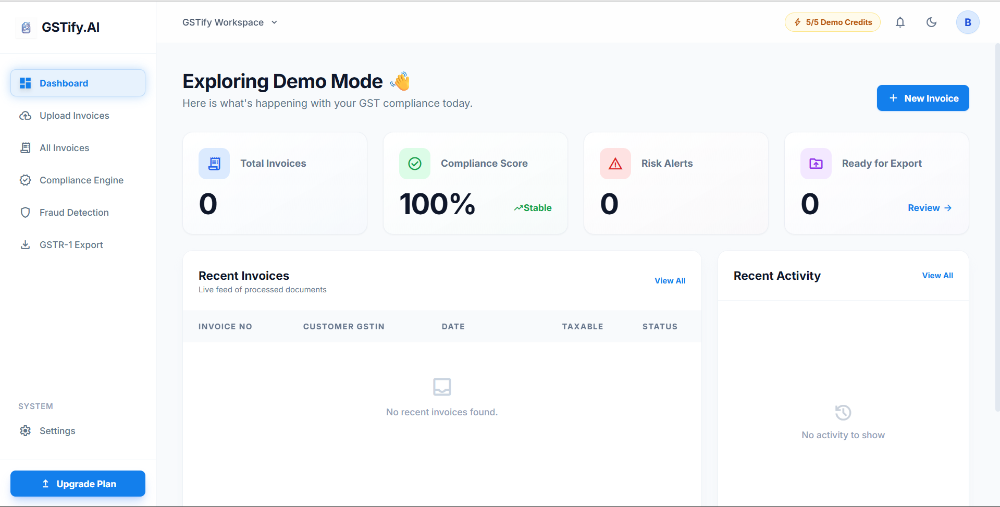
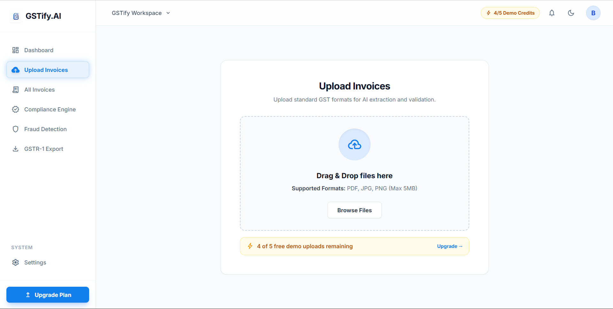
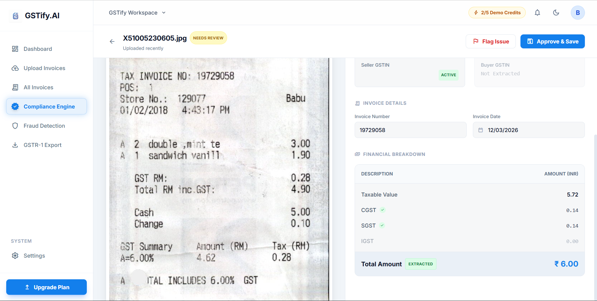
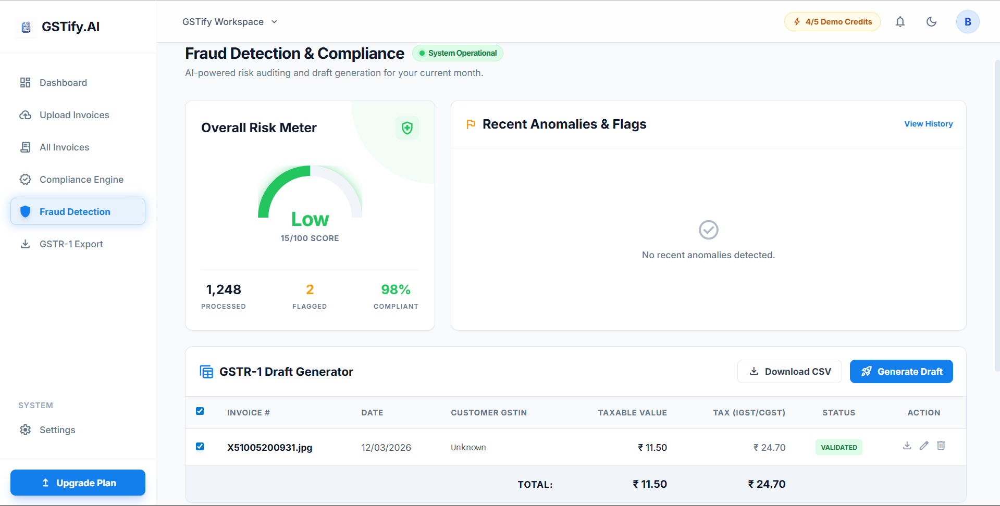

# GSTify AI 🚀

**AI-Powered GST Invoice Processing Platform for Indian MSMEs**

GSTify AI automates the process of extracting, validating, and preparing GST invoice data for filing. Instead of manually entering invoice details during GST filing, users can upload invoice images and let AI process them automatically.

---

## 📌 Problem

Many small businesses and MSMEs in India store invoices as **images or PDFs**. During GST filing, accountants must manually enter the data into the GST portal.

This results in:

* ⏳ Time-consuming manual work
* ❌ Data entry errors
* 📉 Delays in GST compliance
* 💰 Increased accounting effort

---

## 💡 Solution

GSTify AI uses **multimodal AI** to extract and validate invoice information automatically.

Workflow:

Upload Invoice → AI Extraction → GST Validation → Fraud Detection → GSTR-1 Draft Export

---

## ✨ Key Features

* 🤖 **AI Invoice Data Extraction**
* 🧾 **GSTIN Format Validation**
* 🧮 **Tax Calculation Verification**
* 🌍 **Intrastate vs Interstate Detection**
* 🚨 **Fraud & Anomaly Detection**
* 📊 **Compliance Scoring**
* 📁 **GSTR-1 CSV Draft Generation**
* 🖥 **Modern SaaS Dashboard**

---

## 🏗 Project Architecture

```text
Frontend (React + Vite)
        ↓
Flask API Backend
        ↓
AI Processing Engine
        ↓
GST Validation System
        ↓
Fraud Detection Engine
        ↓
GSTR-1 CSV Generator
```

---

## 🧰 Tech Stack

### Frontend

* React
* Vite
* Tailwind CSS
* JavaScript

### Backend

* Python
* Flask
* REST APIs

### AI

* Google Gemini Vision

### Deployment

* Vercel (Frontend)
* Cloud backend service

---

## 📂 Project Structure

```text
GSTify/
│
├── backend/
│   ├── api.py
│   ├── agent.py
│   ├── config.py
│   ├── requirements.txt
│   ├── tools/
│   ├── storage/
│   ├── sample_invoices/
│   └── temp_uploads/
│
├── frontend/
│   ├── public/
│   ├── src/
│   ├── index.html
│   ├── package.json
│   ├── vite.config.js
│   └── tailwind.config.js
│
└── README.md
```

---

## ⚙️ Installation

Clone the repository:

```bash
git clone https://github.com/shashirajj7/GSTify.git
```

Navigate to the project folder:

```bash
cd GSTify
```

---

## ▶️ Run Frontend

```bash
cd frontend
npm install
npm run dev
```

The frontend will run at:

```
http://localhost:5173
```

---

## ▶️ Run Backend

```bash
cd backend
pip install -r requirements.txt
python api.py
```

Backend runs at:

```
http://localhost:5000
```

---

## 📸 Example Workflow

1️⃣ Upload invoice image
2️⃣ AI extracts invoice details
3️⃣ GST rules are validated
4️⃣ Fraud detection scans invoice
5️⃣ System generates GSTR-1 CSV draft

---

## 📸 Application Screenshots

### Dashboard


### Invoice Upload


### AI Extraction & Validation


### Fraud Detection


---

## 🎯 Target Users

* Indian MSMEs
* Chartered Accountants
* GST Practitioners
* Small Businesses

---

## 🚀 Future Improvements

* Google Authentication
* Bulk invoice upload
* Automated GST filing integration
* AI fraud pattern detection
* Multi-user SaaS dashboard

---

## 👨‍💻 Author

**Shashi Raj**

AI developer building tools to simplify compliance and automation for Indian businesses.

GitHub:
https://github.com/shashirajj7

---


